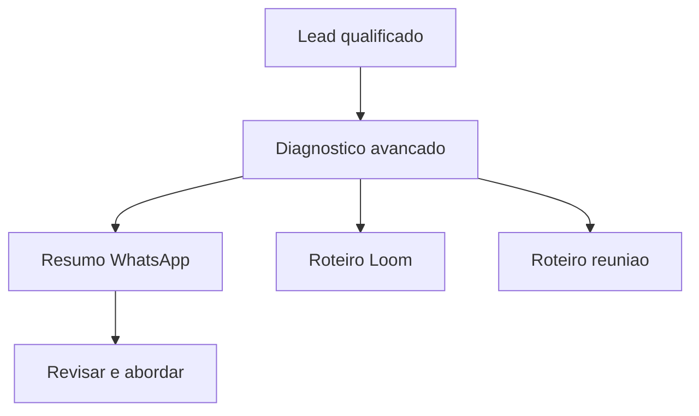

# Mapa Interno - Prospect AI

**Atualizado em:** 05/07/2026  
**Estado atual:** produto interno operacional em `main`, com Autopilot SDR, guia de uso, central de respostas e templates comerciais mergeados. PR #21 prepara diagnostico comercial avancado.

Este documento e a bussola curta do projeto. Use ele para nao perder o fio entre prospeccao real, manutencao tecnica e proximas PRs.

## Objetivo Do Projeto

Prospect AI existe para gerar oportunidades comerciais para um gestor de trafego.

A ferramenta deve:

1. Coletar empresas por nicho, cidade e fonte.
2. Validar e enriquecer contatos.
3. Priorizar leads com score comercial.
4. Gerar diagnosticos e mensagens com IA ou templates assistidos.
5. Organizar o funil no CRM/Kanban.
6. Apoiar disparos e follow-ups pelo WhatsApp com controle humano.
7. Tratar respostas recebidas e sugerir proxima acao comercial.
8. Ajudar o usuario a marcar reunioes e vender servicos digitais.

## Fonte De Verdade

Ordem de confianca:

1. Codigo em `main`.
2. `docs/MAPA-INTERNO.md`.
3. `docs/GUIA-USO-AUTOPILOT.md`.
4. `docs/STATUS-ATUAL.md`.
5. `docs/TODO.md`.
6. `docs/HISTORICO.md`.
7. Documentos operacionais especificos.

Documentos antigos de sprint continuam no repositorio como historico, mas nao devem guiar decisoes atuais se divergirem destes arquivos.

## Marcos Concluidos

| Marco | Estado | Observacao |
|---|---|---|
| Core de leads | Concluido | CRUD, importacao, exportacao, detalhes e analise. |
| Coleta real | Concluido | Serper, Apify e RapidAPI validados em baixo volume. |
| Historico de coletas | Concluido | Runs, logs persistentes, cache e limpeza manual. |
| Credenciais | Concluido | Scrapers e LLMs com chave criptografada e mascarada. |
| WhatsApp Evolution | Concluido | Conexao, chat, envio, webhook e verificacao de numero. |
| CRM Kanban | Concluido | Drag-and-drop, filtros e edicao rapida. |
| Dashboard comercial | Concluido | Funil, fontes, periodo, conversao por nicho/cidade. |
| IA contextual | Concluido | Prompts ajustados por profissao, nicho e contexto interno. |
| Autopilot fundacao | Concluido | Regras, runs e fila. |
| Autopilot API | Concluido | CRUD de regras, fila, lotes e comandos. |
| Aprovacao em lote | Concluido | WhatsApp pessoal aprovou lote real via webhook. |
| Autopilot completo controlado | Concluido | PR #17: central `/autopilot`, scheduler, worker controlado, stop-on-reply, follow-ups, classificacao, agendamento e diagnostico base. |
| Guia operacional do Autopilot | Concluido | PR #18: documenta como usar `/autopilot` com seguranca. |
| Central de respostas | Concluido | PR #19: `/autopilot/replies`, intencao, resposta sugerida e acoes CRM sem envio automatico. |
| Templates comerciais | Concluido | PR #20: `/autopilot/templates`, mensagens por nicho/profissao sem envio automatico. |

## Em Producao Agora - PR #21

Objetivo: transformar diagnostico base em material comercial para abordagem, Loom/audio e reuniao.

Entregas previstas:

- Nova pagina `/autopilot/diagnostics`.
- Endpoint `GET /api/autopilot/diagnostics/:leadId/advanced`.
- Endpoint `POST /api/autopilot/diagnostics/:leadId/advanced/apply`.
- Diagnostico curto para WhatsApp.
- Diagnostico completo em Markdown.
- Roteiro de Loom/audio.
- Roteiro de reuniao de 15 minutos.
- Oferta recomendada: tracking, trafego, site/landing page, conversao WhatsApp/formulario, criativos, CRM ou consultoria.
- Separacao clara entre fatos observados e inferencias comerciais.
- Aplicacao do diagnostico no lead sem criar fila e sem enviar WhatsApp.

Papel no fluxo comercial:



## Estado Operacional Atual

O sistema pode ser usado hoje para:

- coletar leads reais em baixo volume;
- validar WhatsApp antes de salvar;
- revisar leads no CRM;
- gerar abordagem com IA;
- criar fila de mensagens pendentes;
- aprovar lotes pelo WhatsApp pessoal;
- simular envios antes de disparar;
- enviar mensagens aprovadas somente com confirmacao avancada;
- cancelar follow-ups quando houver resposta;
- registrar reunioes e diagnosticos base;
- tratar respostas em `/autopilot/replies`;
- gerar e aplicar templates em `/autopilot/templates`;
- apos PR #21, preparar diagnostico comercial em `/autopilot/diagnostics`.

O sistema ainda nao deve:

- rodar cron automatico em background sem uma decisao explicita;
- disparar em volume alto sem acompanhamento diario;
- agendar reunioes em calendario externo sem confirmacao;
- usar classificacao por LLM paga em background sem limites/custos claros;
- responder leads automaticamente sem aprovacao e configuracao explicita;
- inventar informacoes comerciais ou tecnicas que nao foram observadas no lead.

## Mapa Dos Modulos

| Modulo | Rota/Tela | Backend | Estado |
|---|---|---|---|
| Dashboard | `/dashboard` | `/api/stats` | Operacional |
| Coleta | `/collect` | `/api/leads/collect` | Operacional |
| Historico | `/collections` | `/api/collections` | Operacional |
| Leads | `/leads` e `/leads/:id` | `/api/leads` | Operacional |
| CRM | `/crm` | `/api/leads/:id` | Operacional |
| Credenciais | `/credentials` | `/api/credentials` | Operacional |
| Perfil | `/profile` | `/api/auth/me` | Operacional |
| WhatsApp | `/whatsapp` | `/api/whatsapp` | Operacional |
| IA | Detalhe do lead | `/api/ai` | Operacional |
| Autopilot | `/autopilot` | `/api/autopilot` | Operacional controlado |
| Respostas | `/autopilot/replies` | `/api/autopilot/replies/inbox` | Operacional |
| Templates | `/autopilot/templates` | `/api/autopilot/templates/*` | Operacional |
| Diagnostico | `/autopilot/diagnostics` | `/api/autopilot/diagnostics/:id/advanced` | PR #21 |

## Como Usar O Autopilot

Guia principal: `docs/GUIA-USO-AUTOPILOT.md`.

Resumo operacional:

1. Criar ou revisar regra assistida.
2. Simular scheduler.
3. Enfileirar mensagens `pending`.
4. Criar lote.
5. Aprovar pelo WhatsApp pessoal.
6. Simular envio.
7. Enviar aprovadas somente no modo avancado, com confirmacao.
8. Rodar stop-on-reply.
9. Criar/classificar follow-ups com cuidado.
10. Registrar reunioes.
11. Gerar diagnostico base.
12. Tratar respostas em `/autopilot/replies`.
13. Gerar/aplicar mensagens por nicho em `/autopilot/templates` antes de enfileirar novos contatos.
14. Preparar material de venda em `/autopilot/diagnostics` antes de enviar diagnostico ou marcar reuniao.

## V2 Comercial - Sequencia De PRs

A V2 comercial deve melhorar conversao, nao apenas adicionar automacao.

| Ordem | PR sugerido | Objetivo | Resultado esperado |
|---|---|---|---|
| 18 | Guia e mapa do Autopilot | Ensinar uso, atualizar mapa e alinhar proximos PRs | Usuario entende como operar a pagina atual. |
| 19 | Central de respostas | Mostrar respostas recebidas e proxima acao recomendada | Menos conversa perdida e mais reunioes. |
| 20 | Templates por nicho/profissao | Mensagens por nicho e ponto de vista do gestor de trafego | Abordagens melhores por segmento. |
| 21 | Diagnostico comercial avancado | Diagnostico curto, completo e roteiro de reuniao/Loom | Mais autoridade na abordagem. |
| 22 | Agendamento comercial assistido | Sugestao de horarios, convite e confirmacao | Mais reunioes marcadas com menos trabalho manual. |

## Regras De Seguranca Que Nao Podem Quebrar

1. Nunca commitar `.env`, tokens, API keys ou dumps.
2. Nunca logar headers completos de autenticacao.
3. Nunca retornar chave completa no frontend.
4. Nunca enviar mensagem para lead apenas por aprovar lote.
5. Modo `assistido` sempre exige aprovacao manual.
6. Worker automatico so pode existir com limite diario, limite horario, janela de envio e stop-on-reply.
7. Respostas de aprovacao por WhatsApp devem aceitar apenas `approval_whatsapp` do usuario.
8. Dados de usuario, fila e lotes devem permanecer isolados por `user_id`.
9. Provider externo deve respeitar cota/cache; nao usar rotacao abusiva de credenciais.
10. Toda PR precisa terminar com validacao de testes, build, Docker e scan basico de segredos.
11. Central de respostas pode sugerir e copiar textos, mas nao deve enviar resposta automatica sem confirmacao explicita.
12. Templates podem atualizar texto do lead, mas nao podem enviar WhatsApp automaticamente.
13. Templates devem separar fatos observados de inferencias e nao prometer resultado financeiro.
14. Diagnosticos podem atualizar texto do lead, mas nao podem criar fila nem enviar WhatsApp automaticamente.
15. Diagnosticos devem separar fatos observados de inferencias e nao prometer resultado financeiro.

## Operacao Comercial Enquanto Desenvolve

1. Coletar pequenos lotes por cidade/nicho.
2. Priorizar leads com WhatsApp confirmado e score alto.
3. Usar CRM Kanban para status e proxima acao.
4. Usar `/autopilot/templates` para ajustar mensagem por nicho.
5. Usar `/autopilot/diagnostics` para preparar diagnostico antes de reuniao ou Loom.
6. Usar `/autopilot` para aprovar, simular e enviar com controle.
7. Usar `/autopilot/replies` para tratar respostas e marcar proximas acoes.
8. Medir respostas, reunioes e clientes fechados.
9. Ajustar criterios de score e mensagens com base nas respostas reais.

## Prompt De Validacao Padrao

```text
Valide a PR atual do Prospect AI sem expor segredos.

Execute:
- backend npm install
- backend npm test
- backend npm audit --json
- frontend npm install
- frontend npm run build
- docker compose build backend frontend
- docker compose up -d backend frontend
- GET /health

Valide as telas e rotas afetadas.
Confirme que logs/respostas nao expoem api_key, apiKey, api_key_encrypted, secret, Bearer, x-api-key, x-rapidapi-key ou token real.
Nao tire de draft e nao faca merge se houver falha funcional ou risco de envio automatico nao intencional.
Atualize o corpo do PR com resultados completos.
```

## Proxima Decisao

Validar PR #21 e, depois, seguir para PR #22: agendamento comercial assistido.

Motivo: depois que a abordagem e o diagnostico estiverem bons, o proximo ganho vem de encurtar o caminho ate a reuniao marcada.
