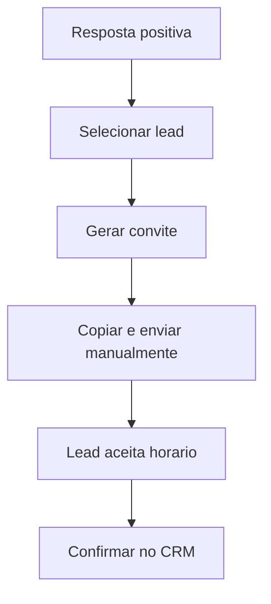

# Mapa Interno - Prospect AI

**Atualizado em:** 05/07/2026  
**Estado atual:** produto interno operacional em `main` com coleta, CRM, WhatsApp, Autopilot SDR, respostas, templates, diagnostico comercial avancado e Autopilot Comercial Semi-Automatico. PR atual adiciona agendamento comercial assistido.

Este documento e a bussola curta do projeto. Use ele para nao perder o fio entre prospeccao real, manutencao tecnica e proximas PRs.

## Objetivo Do Projeto

Prospect AI existe para gerar oportunidades comerciais para um gestor de trafego.

A ferramenta deve:

1. Coletar empresas por nicho, cidade e fonte.
2. Validar e enriquecer contatos.
3. Priorizar leads com score comercial.
4. Gerar diagnosticos e mensagens com IA ou templates assistidos.
5. Organizar o funil no CRM/Kanban.
6. Apoiar disparos e follow-ups pelo WhatsApp com controle humano.
7. Tratar respostas recebidas e sugerir proxima acao comercial.
8. Automatizar a rotina diaria sem perder aprovacao humana nos pontos sensiveis.
9. Ajudar o usuario a marcar reunioes e vender servicos digitais.

## Fonte De Verdade

Ordem de confianca:

1. Codigo em `main`.
2. `docs/MAPA-INTERNO.md`.
3. `docs/AUTOPILOT-SEMI-AUTO.md`.
4. `docs/AGENDAMENTO-COMERCIAL-ASSISTIDO.md`.
5. `docs/GUIA-USO-AUTOPILOT.md`.
6. `docs/STATUS-ATUAL.md`.
7. `docs/TODO.md`.
8. `docs/HISTORICO.md`.
9. Documentos operacionais especificos.

Documentos antigos de sprint continuam no repositorio como historico, mas nao devem guiar decisoes atuais se divergirem destes arquivos.

## Marcos Concluidos

| Marco | Estado | Observacao |
|---|---|---|
| Core de leads | Concluido | CRUD, importacao, exportacao, detalhes e analise. |
| Coleta real | Concluido | Serper, Apify e RapidAPI validados em baixo volume. |
| Historico de coletas | Concluido | Runs, logs persistentes, cache e limpeza manual. |
| Credenciais | Concluido | Scrapers e LLMs com chave criptografada e mascarada. |
| WhatsApp Evolution | Concluido | Conexao, chat, envio, webhook e verificacao de numero. |
| CRM Kanban | Concluido | Drag-and-drop, filtros e edicao rapida. |
| Dashboard comercial | Concluido | Funil, fontes, periodo, conversao por nicho/cidade. |
| IA contextual | Concluido | Prompts ajustados por profissao, nicho e contexto interno. |
| Aprovacao em lote | Concluido | WhatsApp pessoal aprovou lote real via webhook. |
| Autopilot completo controlado | Concluido | Central `/autopilot`, scheduler, worker, stop-on-reply, follow-ups, respostas e diagnosticos. |
| Guia operacional do Autopilot | Concluido | Documenta uso seguro da central manual. |
| Central de respostas | Concluido | `/autopilot/replies`, intencao, resposta sugerida e acoes CRM sem envio automatico. |
| Templates comerciais | Concluido | `/autopilot/templates`, mensagens por nicho/profissao sem envio automatico. |
| Diagnostico comercial avancado | Concluido | `/autopilot/diagnostics`, diagnostico curto/completo, Loom, reuniao e oferta recomendada. |
| Autopilot semi-automatico | Concluido | `/autopilot/semi-auto`, plano por historico, coleta aprovada, lote e worker para aprovadas. |

## Em Producao Agora - Agendamento Comercial Assistido

Objetivo: transformar respostas positivas em reunioes marcadas com menos atrito, mantendo tudo assistido e controlado.

Entregas previstas no PR atual:

- Nova pagina `/autopilot/scheduling`.
- Endpoint `POST /api/autopilot/scheduling/preview`.
- Endpoint `POST /api/autopilot/scheduling/confirm`.
- Servico `commercialSchedulingService.mjs`.
- Sugestao de horarios por timezone, duracao e periodo.
- Mensagem de convite personalizada por lead e perfil profissional do usuario.
- Copia manual da mensagem.
- Confirmacao explicita da reuniao.
- Atualizacao do lead para `reuniao_marcada`.
- Registro em `lead_followups`.
- Guia `docs/AGENDAMENTO-COMERCIAL-ASSISTIDO.md`.

Fluxo alvo:



## Estado Operacional Atual

O sistema pode ser usado hoje para:

- coletar leads reais em baixo volume;
- validar WhatsApp antes de salvar;
- revisar leads no CRM;
- gerar abordagem com IA/templates;
- preparar diagnosticos comerciais;
- criar fila de mensagens pendentes;
- aprovar lotes pelo WhatsApp pessoal;
- enviar mensagens aprovadas com worker controlado;
- cancelar follow-ups quando houver resposta;
- tratar respostas em `/autopilot/replies`;
- rodar a rotina semi-automatica em `/autopilot/semi-auto`;
- medir funil no dashboard.

Com o PR de agendamento validado, o sistema tambem passa a:

- gerar convite de reuniao com horarios sugeridos;
- copiar mensagem pronta para enviar manualmente;
- registrar reuniao no CRM e historico;
- deixar o lead pronto para proposta/reuniao.

O sistema ainda nao deve:

- rodar cron automatico em background sem configuracao explicita;
- disparar em volume alto sem acompanhamento diario;
- responder leads automaticamente sem revisao;
- criar evento em calendario externo sem confirmacao;
- usar LLM paga em background sem limites claros;
- inventar informacoes comerciais ou tecnicas que nao foram observadas.

## Mapa Dos Modulos

| Modulo | Rota/Tela | Backend | Estado |
|---|---|---|---|
| Dashboard | `/dashboard` | `/api/stats` | Operacional |
| Coleta | `/collect` | `/api/leads/collect` | Operacional |
| Historico | `/collections` | `/api/collections` | Operacional |
| Leads | `/leads` e `/leads/:id` | `/api/leads` | Operacional |
| CRM | `/crm` | `/api/leads/:id` | Operacional |
| Credenciais | `/credentials` | `/api/credentials` | Operacional |
| Perfil | `/profile` | `/api/auth/me` | Operacional |
| WhatsApp | `/whatsapp` | `/api/whatsapp` | Operacional |
| IA | Detalhe do lead | `/api/ai` | Operacional |
| Autopilot manual | `/autopilot` | `/api/autopilot` | Operacional controlado |
| Autopilot semi-auto | `/autopilot/semi-auto` | `/api/autopilot/semi-auto/*` | Operacional |
| Respostas | `/autopilot/replies` | `/api/autopilot/replies/inbox` | Operacional |
| Templates | `/autopilot/templates` | `/api/autopilot/templates/*` | Operacional |
| Diagnostico | `/autopilot/diagnostics` | `/api/autopilot/diagnostics/:id/advanced` | Operacional |
| Agendamento | `/autopilot/scheduling` | `/api/autopilot/scheduling/*` | PR atual |

## Como Usar O Autopilot

Guias principais:

- `docs/AUTOPILOT-SEMI-AUTO.md`: rotina diaria semi-automatica.
- `docs/AGENDAMENTO-COMERCIAL-ASSISTIDO.md`: convite e confirmacao de reuniao.
- `docs/GUIA-USO-AUTOPILOT.md`: central manual/avancada.

Resumo operacional semi-auto:

1. Abrir `/autopilot/semi-auto`.
2. Atualizar plano.
3. Conferir query, credencial, cidade, nicho, score e lote.
4. Simular ciclo completo.
5. Aprovar coleta e preparar lote.
6. Aprovar lote pelo WhatsApp pessoal.
7. Enviar aprovadas agora.
8. Acompanhar respostas e stop-on-reply.
9. Usar `/autopilot/scheduling` para transformar respostas positivas em reuniao.
10. Usar CRM para propostas e fechamentos.

## V2 Comercial - Sequencia Atual

A V2 comercial deve melhorar conversao e diminuir trabalho manual sem perder controle.

| Ordem | PR sugerido | Objetivo | Resultado esperado |
|---|---|---|---|
| 18 | Guia e mapa do Autopilot | Ensinar uso e alinhar mapa | Usuario entende a central manual. |
| 19 | Central de respostas | Tratar respostas e proxima acao | Menos conversa perdida. |
| 20 | Templates por nicho/profissao | Melhorar abordagem por segmento | Mensagens mais fortes. |
| 21 | Diagnostico comercial avancado | Preparar Loom/reuniao/oferta | Mais autoridade comercial. |
| 22 | Autopilot semi-automatico | Orquestrar coleta, analise, lote e aprovadas | Rotina diaria com menos cliques. |
| 23 | Agendamento comercial assistido | Sugerir horarios e confirmar reuniao | Mais reunioes marcadas. |
| 24 | Cron controlado futuro | Rodar ciclos em horarios definidos | Operacao recorrente com limites. |

## Regras De Seguranca Que Nao Podem Quebrar

1. Nunca commitar `.env`, tokens, API keys ou dumps.
2. Nunca logar headers completos de autenticacao.
3. Nunca retornar chave completa no frontend.
4. Nunca enviar mensagem para lead apenas por aprovar lote.
5. Modo `assistido` sempre exige aprovacao manual.
6. Worker automatico so pode existir com limite diario, limite horario, janela de envio e stop-on-reply.
7. Respostas de aprovacao por WhatsApp devem aceitar apenas `approval_whatsapp` do usuario.
8. Dados de usuario, fila e lotes devem permanecer isolados por `user_id`.
9. Provider externo deve respeitar cota/cache; nao usar rotacao abusiva de credenciais.
10. Toda PR precisa terminar com validacao de testes, build, Docker e scan basico de segredos.
11. Central de respostas pode sugerir e copiar textos, mas nao deve enviar resposta automatica sem confirmacao explicita.
12. Templates podem atualizar texto do lead, mas nao podem enviar WhatsApp automaticamente.
13. Diagnosticos podem atualizar texto do lead, mas nao podem criar fila nem enviar WhatsApp automaticamente.
14. Autopilot semi-auto pode processar mensagens aprovadas, mas somente `message_queue.status = approved`.
15. Coleta semi-automatica real exige `approve_collection=true`.
16. Agendamento assistido pode registrar CRM/historico, mas nao pode enviar WhatsApp nem criar calendario externo automaticamente.

## Operacao Comercial Enquanto Desenvolve

1. Abrir `/autopilot/semi-auto` no inicio do dia.
2. Simular o ciclo.
3. Rodar coleta aprovada com lote pequeno.
4. Aprovar lote pelo WhatsApp pessoal.
5. Processar aprovadas.
6. Usar `/autopilot/replies` para respostas.
7. Usar `/autopilot/scheduling` para confirmar reunioes.
8. Usar `/crm` para propostas e fechamentos.
9. Medir respostas, reunioes e clientes fechados.
10. Ajustar score, nichos e mensagens com base nas respostas reais.

## Prompt De Validacao Padrao

```text
Valide a PR atual do Prospect AI sem expor segredos.

Execute:
- backend npm install
- backend npm test
- backend npm audit --json
- frontend npm install
- frontend npm run build
- docker compose build backend frontend
- docker compose up -d backend frontend
- GET /health

Valide as telas e rotas afetadas.
Confirme que logs/respostas nao expoem api_key, apiKey, api_key_encrypted, secret, Bearer, x-api-key, x-rapidapi-key ou token real.
Nao tire de draft e nao faca merge se houver falha funcional ou risco de envio automatico nao intencional.
Atualize o corpo do PR com resultados completos.
```

## Proxima Decisao

Validar o PR de agendamento comercial assistido pela CLI local.

Motivo: ele fecha o caminho entre resposta positiva e reuniao marcada, sem depender de calendario externo ou envio automatico.